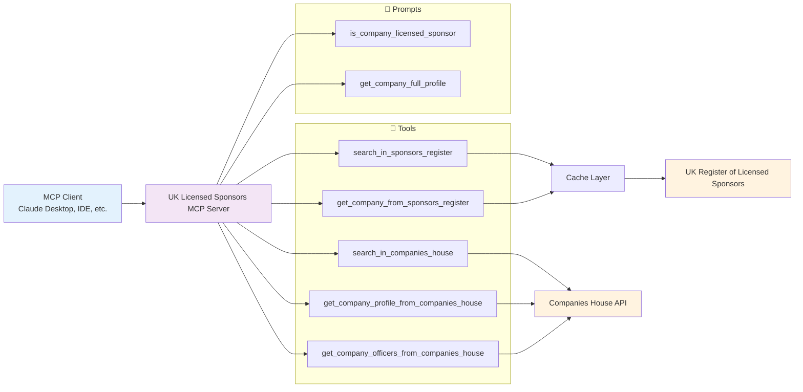

<div align="center">

# UK Licensed Sponsors MCP
#### **Model Context Protocol (MCP) Server for UK Visa Sponsor Verification and Background Checking**

---

### 👨‍💻 Author

**Ivan Yang Rodriguez Carranza**

[](mailto:ivanrodcar@outlook.com)
[](https://www.linkedin.com/in/irodcar)
[](https://github.com/rodcar)

</div>

---

## 📋 Table of Contents

- [🎯 Overview](#-overview)
- [🎬 Demo](#-demo)
- [🔧 Tools](#-tools)
- [💬 Prompts](#-prompts)
- [🚀 How to Use](#-how-to-use)
- [💡 Examples](#-examples)
- [🏛️ Architecture Diagram](#️-architecture-diagram)
- [📝 License](#-license)
- [🙏 Acknowledgments](#-acknowledgments)

---

## 🎯 Overview

UK Licensed Sponsors MCP is a **Model Context Protocol (MCP) server** that provides **verification and background checking** for companies on the UK's official [Register of Worker and Temporary Worker licensed sponsors](https://www.gov.uk/government/publications/register-of-licensed-sponsors-workers) (including sponsors for the **Skilled Worker visa**). This server enables AI agents and applications to verify if companies are licensed to sponsor individuals and perform comprehensive company research through a standardized MCP interface. This helps international students, job seekers, and immigration professionals to assess potential employers and their sponsorship status.

---

## 🎬 Demo

<div align="center">
   
https://github.com/user-attachments/assets/98fe629c-e7ca-42b3-ba92-31225796ebcb

</div>

---

## 🔧 Tools

| Name | Input | Description |
|------|-------|-------------|
| `search_in_sponsors_register` | `company_name` | Search for companies in the UK's register of licensed sponsors |
| `get_company_from_sponsors_register` | `company_name` | Get a company's entry from the licensed sponsors register |
| `search_in_companies_house` | `company_name` | Search for companies using the official Companies House API |
| `get_company_profile_from_companies_house` | `company_number` | Get detailed company profile information from Companies House |
| `get_company_officers_from_companies_house` | `company_number` | Get company officers information (directors, secretaries, etc.) from Companies House |

> **Note:** It's possible that a search may not find a company on the results, even if it is on the official register. The `search_in_sponsors_register` tool uses fuzzy string matching and may return multiple potential matches, with the results limited to the top 10. It is up to the agent or LLM to select the correct company from the results.

---

## 💬 Prompts

| Name | Input | Description |
|------|-------|-------------|
| `is_company_licensed_sponsor` | `company_name` | Checks if a company is licensed to sponsor workers |
| `get_company_full_profile` | `company_name` | Retrieves the complete company profile from the sponsor register and Companies House. |

---

## 🚀 How to Use

### **Claude Desktop (Remote Server)**

> **Note:** Requires `npx` which comes bundled with npm. If you don't have npm installed, install [Node.js](https://nodejs.org/) which includes npm.

Add to Claude Desktop config (Claude > Settings > Developer > Edit Config):
   ```json
   {
     "mcpServers": {
       "uk_licensed_sponsors": {
         "command": "npx",
         "args": [
           "mcp-remote",
           "https://uk-licensed-sponsors.onrender.com/mcp"
         ]
       }
     }
   }
   ```

### **Local Server**

> **Note:** A Companies House API key is required for full functionality. Get your free API key from [Companies House Developer Hub](https://developer.company-information.service.gov.uk/). The sponsor register search works without an API key.

> **Important:** When setting up your Companies House API key, you need to configure `http://my.localdomain` as a "JavaScript domain", and set up localhost domain mapping for your actual IP address to `http://my.localdomain`. See our [Localhost Domain Mapping Guide](localhost-domain-mapping.md) for detailed steps on how to configure your hosts file.

> **Note:** Make sure you have `uv` installed. If not, install it from [uv.tool](https://docs.astral.sh/uv/getting-started/installation/).

Clone and install:
   ```bash
   git clone https://github.com/rodcar/uk-licensed-sponsors.git
   cd uk-licensed-sponsors
   uv sync
   ```

Set up environment variables (optional - required for Companies House integration):
   ```bash
   echo "COMPANIES_HOUSE_API_KEY=your_api_key_here" > .env
   ```

Add to Claude Desktop config (Claude > Settings > Developer > Edit Config):

> **Note:** Replace `/path/to/uk-licensed-sponsors` with the actual path where you cloned the repository.

   ```json
   {
     "mcpServers": {
       "uk_licensed_sponsors": {
         "command": "uv",
         "args": [
           "--directory",
           "/path/to/uk-licensed-sponsors",
           "run",
           "main.py"
         ]
       }
     }
   }
   ```

### **MCP Inspector (Alternative)**

> **Note:** A Companies House API key is required for full functionality. Get your free API key from [Companies House Developer Hub](https://developer.company-information.service.gov.uk/). The sponsor register search works without an API key.

> **Important:** When setting up your Companies House API key, you need to configure `http://my.localdomain` as a "JavaScript domain", and set up localhost domain mapping for your actual IP address to `http://my.localdomain`. See our [Localhost Domain Mapping Guide](localhost-domain-mapping.md) for detailed steps on how to configure your hosts file.

> **Note:** Requires `npx` which comes bundled with npm. If you don't have npm installed, install [Node.js](https://nodejs.org/) which includes npm.

> **Note:** Replace `/path/to/uk-licensed-sponsors` with the actual path where you cloned the repository.

Run:

```bash
npx @modelcontextprotocol/inspector \
  uv \
  --directory /path/to/uk-licensed-sponsors \                     
  run \
  main.py
```

Open MCP Inspector (URL displayed in the console) and configure the MCP client with the following settings:
   - **Transport Type:** STDIO
   - **Command:** `python`
   - **Arguments:** `main.py`

---

## 💡 Examples

> **Note:** The companies for the examples were selected at random.

| Prompt | Company Name | Conversation |
|--------|--------------|-------------|
| `is_company_licensed_sponsor` | 17 Capital Services Ltd | [https://claude.ai/share/f39ee0f7-f7a2-4fb7-ba52-4a91aff39c17](https://claude.ai/share/f39ee0f7-f7a2-4fb7-ba52-4a91aff39c17) |
| `get_company_full_profile` | CVK INFOTECH LTD | [https://claude.ai/share/05de8264-49d0-46cb-a2bd-8f8ed69647c3](https://claude.ai/share/05de8264-49d0-46cb-a2bd-8f8ed69647c3) |

---

## 🏛️ Architecture Diagram

UK Licensed Sponsors MCP follows the Model Context Protocol specification and provides access to the UK's Register of Licensed Sponsors and Companies House data for visa sponsorship verification.



---

## 📝 License

This project is licensed under the [Apache License 2.0](LICENSE).

---

<div align="center">

[Report Bug](https://github.com/rodcar/bcrp-mcp/issues) · [Request Feature](https://github.com/rodcar/bcrp-mcp/issues)

</div>
